###  **cms网站地址** 

<!--
[文档](https://myxzjie.github.io/cms)
-->

地址：[http://www.dev56.com/](http://www.dev56.com/)
<!-- 地址(临时)：[http://cms.dev56.com/](http://cms.dev56.com/) -->
地址：[http://cms-admin.dev56.com/](http://cms-admin.dev56.com/)

账号密码: admin/123qwe

### docker一键部署体验cms网站

> - 进入qq群下载 docker-compose.yml 
> - 或者git clone
> - git clone https://gitee.com/xzjie/cms.git
> - git clone https://github.com/myxzjie/cms.git

> - docker-compose up -d

> - 后台访问: http://localhost:8092
> - 账号/密码: admin/admin

> - 前台访问: http://localhost:8091

### 关注公众号获得后台管理前端源码
 >- 关注公众号回复【cms-admin】
 >- 有问题关注公众号,发送问题信息，客服会第一时间回复你
 >- 目前前端源码需要付费，关注公众号咨询
 

---

 ### **打个广告，有需要可以联系我。^_^**

好酒仓小程序

有需要，可以联系我。

<!--
**关注公众号**  &nbsp; &nbsp;&nbsp;&nbsp;&nbsp;&nbsp;&nbsp;&nbsp;&nbsp;&nbsp;&nbsp;&nbsp;&nbsp;&nbsp;&nbsp;&nbsp;&nbsp;&nbsp;&nbsp;&nbsp;&nbsp;&nbsp;&nbsp;&nbsp;  **小程序**
 

-->

---

### **问题反馈**

**大家如果在使用过程有什么问题，欢迎通过 issues与我们交流！**

**如果本项目对您有所帮助或者启发，请给个 Star 吧，您的鼓励是我最大对动力...**

**QQ群：203498970**

**QQ: 513961835**

**有需要定制，随时欢迎……^_^**

使用技术框架

| 核心技术 | 版本 |
|---|---|
| spring boot | 2.4.0 |
| spring security | 2.4.0 |
| quartz | 2.3.2 |
| jpa | 2.4.0 |
| mysql | 8.0.x |
| redis | 6.0.x |
| minio | - |
| aliyun oss | - |
| vue | 2.6.x |
| element-ui | - |
| docker | - |

---

### 后台功能截图：

- 想要体验功能，可以通过以上方式联系.

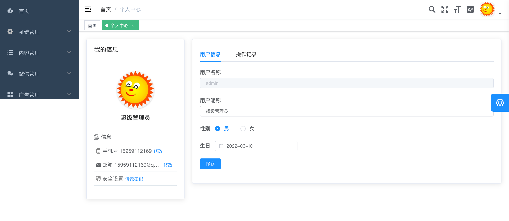

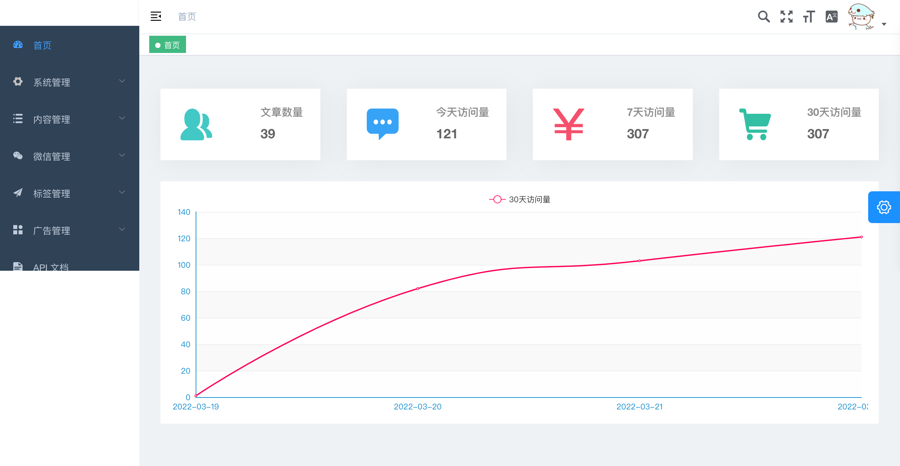

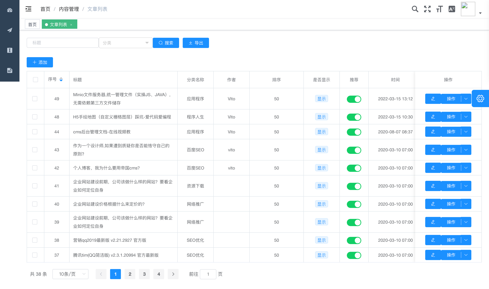

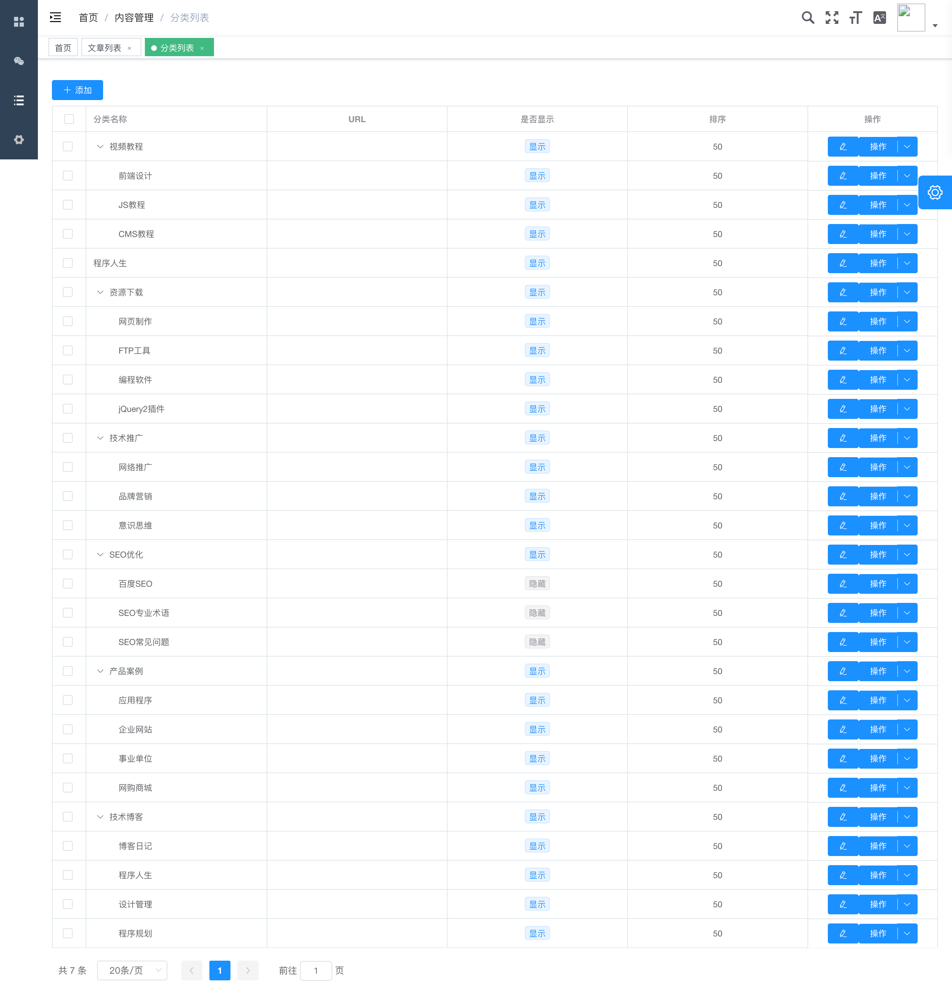

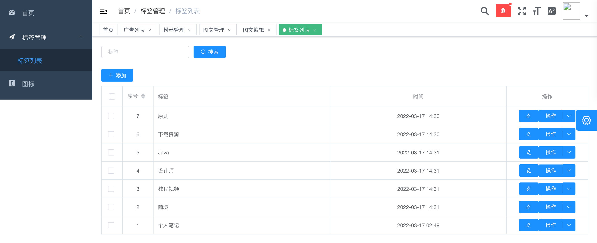

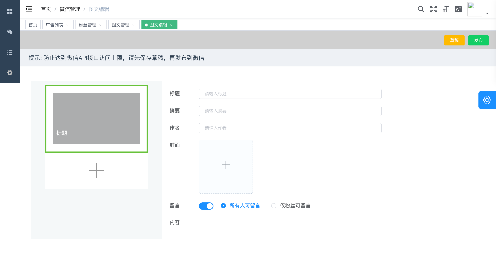

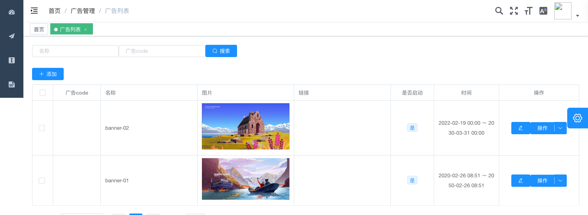

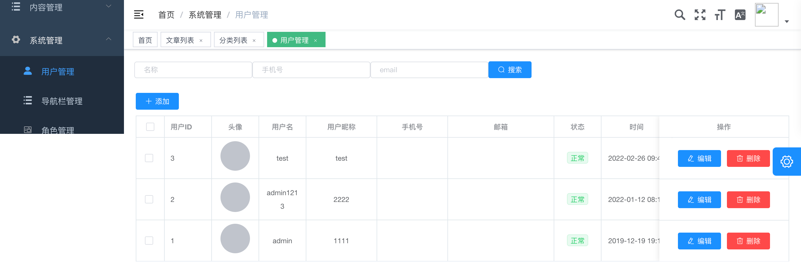

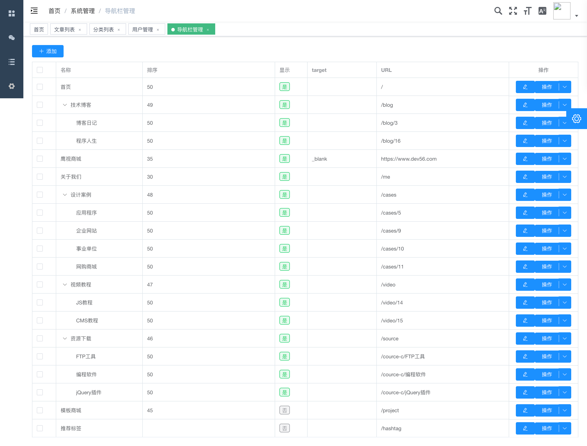

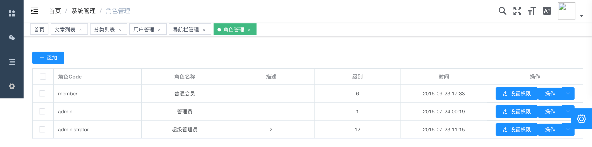

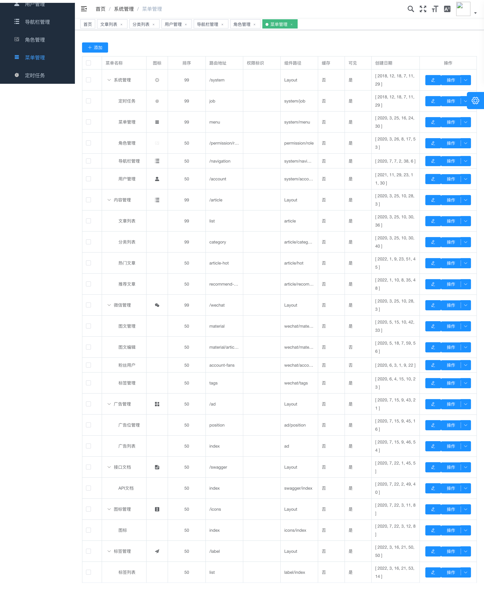

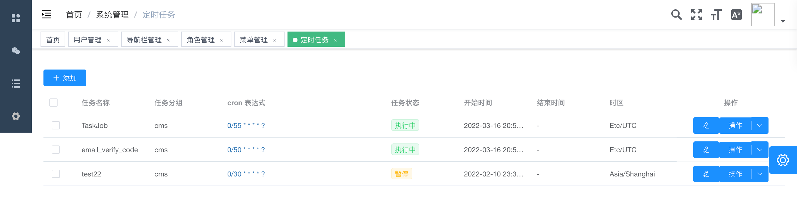

 **4.MYSQL数据模型：** 

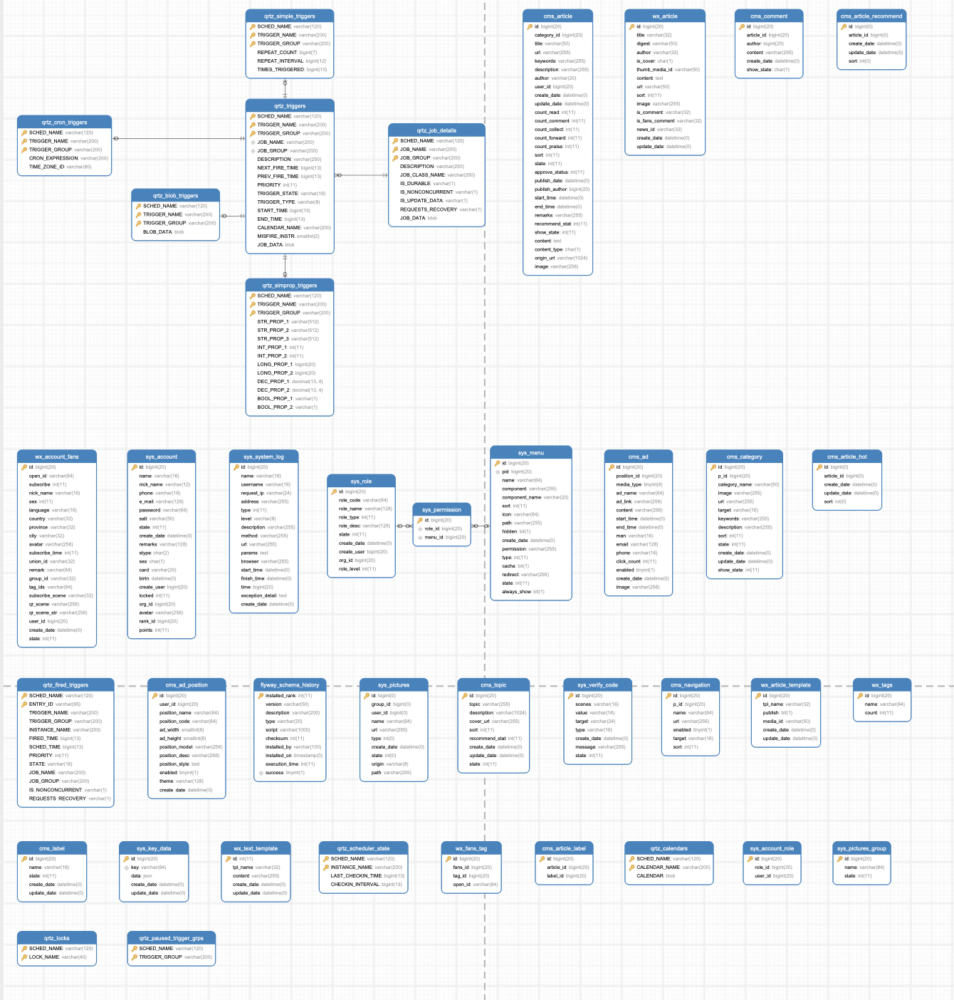

